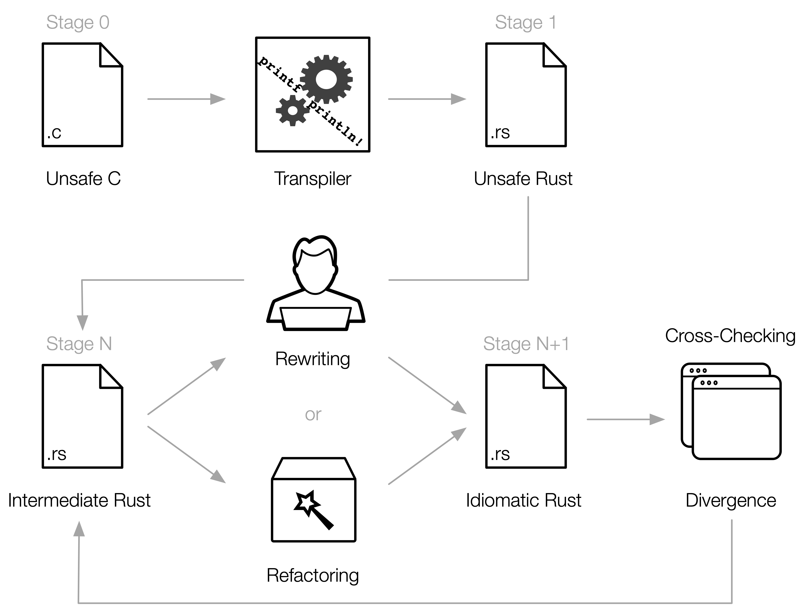

# C2Rust

[![GitHub Actions Status]][github] [![Azure Build Status]][azure] [![Latest Version]][crates.io] [![Rustc Version]](#)

[GitHub Actions Status]: https://github.com/immunant/c2rust/workflows/c2rust-testsuite/badge.svg
[github]: https://github.com/immunant/c2rust/actions
[Azure Build Status]: https://dev.azure.com/immunant/c2rust/_apis/build/status/immunant.c2rust?branchName=master
[azure]: https://dev.azure.com/immunant/c2rust/_build/latest?definitionId=1&branchName=master

[Latest Version]: https://img.shields.io/crates/v/c2rust.svg
[crates.io]: https://crates.io/crates/c2rust
[Rustc Version]: https://img.shields.io/badge/rustc-nightly--2022--02--14-lightgrey.svg "Rustc nightly-2022-02-14"

C2Rust helps you migrate C99-compliant code to Rust.
The translator (or transpiler), [`c2rust transpile`](./c2rust-transpile/),
produces unsafe Rust code that closely mirrors the input C code.
The primary goal of the translator is to preserve functionality;
test suites should continue to pass after translation.

Generating safe and idiomatic Rust code from C ultimately requires manual effort.
We are currently working on analysis to automate some of the effort
required to lift unsafe Rust into safe Rust types.
This work is still in the early stages; please get in touch if you're interested!
We previously maintained a scriptable refactoring tool, [`c2rust refactor`](./c2rust-refactor/),
that reduces the tedium of refactoring, but this tool is now deprecated
so that we can move forward with a recent Rust toolchain.

Here's the big picture:



To learn more, check out our [RustConf'18](https://www.youtube.com/watch?v=WEsR0Vv7jhg) talk on YouTube
and try the C2Rust translator online at [c2rust.com](https://www.c2rust.com).

## Documentation

To learn more about using and developing C2Rust, check out the [manual](https://c2rust.com/manual/).
The manual is still a work-in-progress, so if you can't find something please let us know.

<!-- ANCHOR: installation -->

## Installation

### Prerequisites

C2Rust requires LLVM 7 or later with its corresponding clang compiler and libraries.
Python 3.6 or later, CMake 3.5 or later, and openssl (1.0) are also required. These prerequisites may be installed with the following commands, depending on your platform:

- **Ubuntu 18.04, Debian 10, and later:**

    ```sh
    apt install build-essential llvm clang libclang-dev cmake libssl-dev pkg-config python3 git
    ```

Depending on the LLVM distribution, the `llvm-dev` package may also be required.
For example, the official LLVM packages from [apt.llvm.org](https://apt.llvm.org/) require `llvm-dev` to be installed.

- **Arch Linux:**

    ```sh
    pacman -S base-devel llvm clang cmake openssl python
    ```

- **NixOS / nix:**

    ```sh
    nix-shell
    ```

- **macOS:** Xcode command-line tools and recent LLVM (we recommend the Homebrew version) are required.

    ```sh
    xcode-select --install
    brew install llvm python3 cmake openssl
    ```

The C2Rust transpiler now builds using a stable Rust compiler.
If you are developing other features,
you may need to install the correct nightly compiler version.

### Installing from crates.io

```sh
cargo install c2rust
```

You can also set the LLVM version explicitly if you have multiple installed,
like this, for example:

```sh
LLVM_CONFIG_PATH=llvm-config-14 cargo install c2rust
```

On macOS with Homebrew LLVM, you need to point the build system at the LLVM installation. The path for the installation is architecture dependent:

- **Intel Macs:**

    ```sh
    LLVM_CONFIG_PATH=/usr/local/opt/llvm/bin/llvm-config cargo install c2rust
    ```


- **Apple Silicon Macs:**

    ```sh
    LLVM_CONFIG_PATH=/opt/homebrew/opt/llvm/bin/llvm-config cargo install c2rust
    ```

On Linux with Linuxbrew LLVM, you need to point the build system at the LLVM installation as follows:

```sh
LLVM_CONFIG_PATH=/home/linuxbrew/.linuxbrew/opt/llvm/bin/llvm-config cargo install c2rust
```

Note: adjust `LLVM_CONFIG_PATH` accordingly if Linuxbrew was installed to your home directory.

On Gentoo, you need to point the build system to
the location of `libclang.so` and `llvm-config` as follows:

```sh
LLVM_CONFIG_PATH=/path/to/llvm-config LIBCLANG_PATH=/path/to/libclang.so cargo install c2rust
```

If you have trouble with building and installing, or want to build from the latest master,
the [developer docs](docs/README-developers.md#building-with-system-llvm-libraries)
provide more details on the build system.

### Installing from Git

If you'd like to check our recently developed features or you urgently require a bugfixed version of `c2rust`,
you can install it directly from Git:

```sh
cargo install --git https://github.com/immunant/c2rust.git c2rust
```

Please note that the master branch is under constant development and you may experience issues or crashes.

You should also set `LLVM_CONFIG_PATH` accordingly if required as described above.

<!-- ANCHOR_END: installation -->
<!-- ANCHOR: translating-c-to-rust -->

## Translating C to Rust

To translate C files specified in `compile_commands.json` (see below),
run the `c2rust` tool with the `transpile` subcommand:

```sh
c2rust transpile compile_commands.json
```

`c2rust` also supports a trivial transpile of source files, e.g.:

```sh
c2rust transpile project/*.c project/*.h
```

(The `c2rust refactor` tool was also available for refactoring Rust code, see [refactoring](./c2rust-refactor/), but is now being replaced by a more robust way to refactor.)

For non-trivial projects, the translator requires the exact compiler commands used to build the C code.
This information is provided via a [compilation database](https://clang.llvm.org/docs/JSONCompilationDatabase.html) file named `compile_commands.json`.
(Read more about [compilation databases here](https://sarcasm.github.io/notes/dev/compilation-database.html)).
Many build systems can automatically generate this file;
we show [a few examples below](#generating-compile_commandsjson-files).

Once you have a `compile_commands.json` file describing the C build,
translate the C code to Rust with the following command:

```sh
c2rust transpile path/to/compile_commands.json
```

To generate a `Cargo.toml` template for a Rust library, add the `-e` option:

```sh
c2rust transpile --emit-build-files path/to/compile_commands.json
```

To generate a `Cargo.toml` template for a Rust binary, do this:

```sh
c2rust transpile --binary myprog path/to/compile_commands.json
```

Where `--binary myprog` tells the transpiler to use
the `main` function from `myprog.rs` as the entry point for a binary.

The translated Rust files will not depend directly on each other like
normal Rust modules.
They will export and import functions through the C API.
These modules can be compiled together into a single static Rust library or binary.

There are several [known limitations](./docs/known-limitations.md) in this
translator.
The translator will emit a warning and attempt to skip function
definitions that cannot be translated.

### Generating `compile_commands.json` Files

The `compile_commands.json` file can be automatically created
using either `cmake`, `meson`, `intercept-build`, or `bear`.

It may be a good idea to remove optimizations (`-OX`) from the compilation database,
as there are optimization builtins which we do not support translating.

#### ... with `cmake`

When creating the initial build directory with `cmake`,
specify `-DCMAKE_EXPORT_COMPILE_COMMANDS=1`.
This only works on projects configured to be built by `cmake`.
This works on Linux and MacOS.

```sh
cmake -DCMAKE_EXPORT_COMPILE_COMMANDS=1 ...
```

#### ... with `meson`

When creating the initial build directory with `meson`,
it will automatically generate a `compile_commands.json`
file inside of `<build_dir>`.

```sh
meson setup <build_dir>
```

#### ... with `intercept-build`

`intercept-build` (part of the [scan-build tool](https://github.com/rizsotto/scan-build))
is recommended for non-`cmake` projects.
`intercept-build` is bundled with `clang` under `tools/scan-build-py`,
but a standalone version can be easily installed via `pip` with:

```sh
pip install scan-build
```

Usage:

```sh
intercept-build <build command>
```

You can also use `intercept-build` to generate a compilation database
for compiling a single C file.  For example:

```sh
intercept-build sh -c "cc program.c"
```

#### ... with `bear` (Linux only)

If you have [`bear`](https://github.com/rizsotto/Bear) installed,
it can be used similarly to `intercept-build`:

```sh
bear -- <build command>
```

#### ... with `compiledb`

The `compiledb` package can also be used for makefile projects if the other tools don't work.
Install via `pip` with:

```sh
pip install compiledb
```

Usage:

```sh
# After running
./autogen.sh && ./configure # etc.
# Run
compiledb make
```

<!-- ANCHOR_END: translating-c-to-rust -->

## Contact

To report issues with translation or refactoring,
please use our [Issue Tracker](https://github.com/immunant/c2rust/issues).

To reach the development team, join our [discord channel](https://discord.gg/ANSrTuu)
or email us at [c2rust@immunant.com](mailto:c2rust@immunant.com).

## FAQ

> I translated code on platform X, but it didn't work correctly on platform Y.

We run the C preprocessor before translation to Rust.
This specializes the code to the host platform.
For this reason, we do not support cross compiling translated code at the moment.

> What platforms can C2Rust be run on?

The translator and refactoring tool support both macOS and Linux.
Other features, such as cross checking the functionality
between C and Rust code, are currently limited to Linux hosts.

## Uses of `c2rust transpile`

This is a list of all significant uses of `c2rust transpile` that we know of:

| Rust | C | By | Safety | Description |
| - | -- | - | - | - |
| [`rav1d`](https://github.com/memorysafety/rav1d/) | [`dav1d`](https://code.videolan.org/videolan/dav1d) | @memorysafety, @immunant | fully safe | AV1 decoder |
| [`rexpat`](https://github.com/immunant/rexpat) | [`libexpat`](https://github.com/libexpat/libexpat) | @immunant | safety unfinished | streaming XML parser |
| [`unsafe-libyaml`](https://github.com/dtolnay/unsafe-libyaml) | [`libyaml`](https://github.com/yaml/libyaml) | @dtolnay | minor cleanup, fully unsafe | YAML parser and writer used by [`serde_yaml`](https://github.com/dtolnay/serde-yaml)
| [`libyaml-safer`](https://github.com/simonask/libyaml-safer) | [`libyaml`](https://github.com/yaml/libyaml) | @simonask | fully safe | safe fork of [`unsafe-libyaml`](https://github.com/dtolnay/unsafe-libyaml) |
| [`libbzip2-rs`](https://github.com/trifectatechfoundation/libbzip2-rs) | [`bzip2`](https://gitlab.com/bzip2/bzip2) | @trifectatechfoundation | fully safe | file compression |
| [`tsuki`](https://github.com/ultimaweapon/tsuki) | [`lua`](https://www.lua.org/source/5.4/) | @ultimaweapon | fully safe | Lua interpreter |
| [`spiro.rlib`](https://github.com/MFEK/spiro.rlib) | [`spiro`](https://github.com/raphlinus/spiro) | @ctrlcctrlv | fully safe | spline interpolation |
| [`sapp-kms`](https://crates.io/crates/sapp-kms) | [`sokol`](https://github.com/floooh/sokol) | @not-fl3 | cleaned up, still unsafe | application rendering library |

If any other project successfully uses `c2rust`, feel free to add your ported project here.

## Acknowledgements and Licensing

This material is available under the BSD-3 style license as found in the
[LICENSE](./LICENSE) file.

The C2Rust translator is inspired by Jamey Sharp's [Corrode](https://github.com/jameysharp/corrode) translator.
We rely on [Emscripten](https://github.com/kripken/emscripten)'s
Relooper algorithm to translate arbitrary C control flows.
Many individuals have contributed bug fixes and improvements to C2Rust; thank you so much!

This material is based upon work supported by the United States Air Force and
DARPA under Contracts No. FA8750-15-C-0124, HR0011-22-C-0020, and HR00112590133.
Any opinions, findings and conclusions or recommendations expressed in this
material are those of the author(s) and do not necessarily reflect the views
of the United States Air Force or DARPA.

Distribution Statement A, "Approved for Public Release, Distribution Unlimited."
